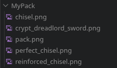
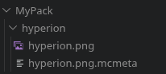
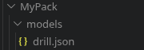

## a tool to create hypixel skyblock texture packs from png files

this converts png files into a useable hypixel skyblock texture pack

run `main.js`, select the input and output directories when prompted and it will map all the textures to their respective models as listed in `id_models.json`.

the pack name will be the same as the input directory name. each texture image should be named to the skyblock id of the item, except for configs(see configs section)

it also gets pack.png from there.



any unassigned textures will be output to the logs folder in the repo for you to look through.

if there's an issue such as a missing id for an item, open an issue on github so it can be fixed.


## animated textures

for animated textures put the texture and png in a folder both named to the skyblock item id as well as the mcmeta file.



## configs
### if you only care about basic textures then theres no need to read this.

things can break if you don't do use this correctly, so read this on how to use configs.

a configs file will let you add some extra properties to an item texture.

add a configs.json file in a folder the same way as a mcmeta file for animated.

```json
{
    "model": "custom_model_name",
    "held": "custom_model_name"
    "modifier": {
        "reforge_id": "prefix",
        "reforge_id": "prefix",
    }
}
```

#### "model": "custom_model_name"

this is to choose a custom model replace `"custom_model_name"` with the file name of the model you want to use.

custom models can be added to the pack by putting them in a 'models' folder and putting it in the input folder



#### "held": "custom_model_name"

this lets you choose a separate model and texture for gui or held versions of an item. uses `"custom_model_name"` for the model of the held version.

this requires a second texture for the held version. searches for a texture named `"{skyblock_id}_held"` **(example: hyperion_held)**.

held overrides model, such to say, model will do nothing when held is used.

#### "modifier": {"reforge_id": "prefix"...}

this lets you choose a texture when a specific reforge is applied.

reforge_id is the id of the skyblock reforge, prefix is the filename prefix to look for and can be anything.

requires a second texture with a matching prefix, example `aspect_of_the_void` and `warped_aspect_of_the_void`. searches like this: `{prefix}_{skyblock_id}`, you dont include the '_'.

i made this for fun so dont expect perfection ngl